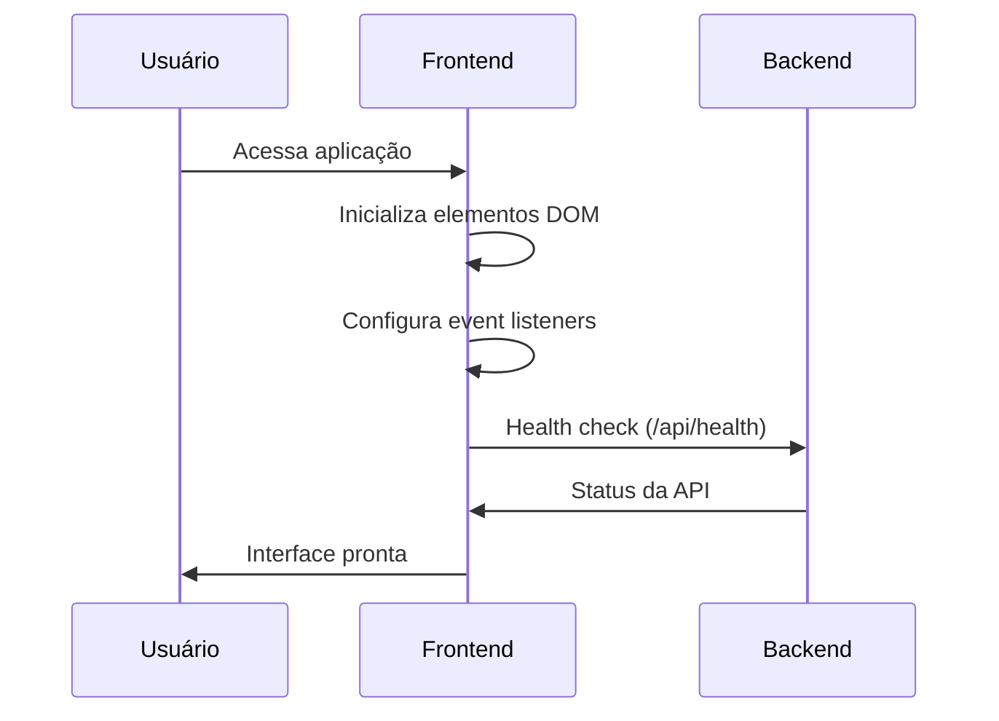
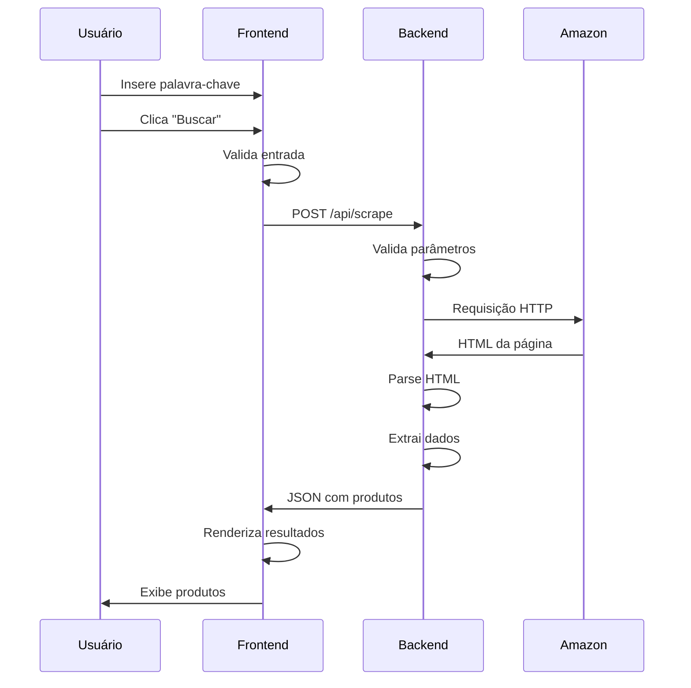

# Documentação Técnica - Amazon Product Scraper

## Arquitetura Detalhada

### Visão Geral do Sistema

O Amazon Product Scraper é construído seguindo uma arquitetura de separação clara entre frontend e backend, permitindo escalabilidade e manutenibilidade. O sistema utiliza uma abordagem RESTful para comunicação entre as camadas.

### Componentes Principais

#### 1. Backend (Flask Application)

**Responsabilidades:**
- Processamento de requisições HTTP
- Execução do web scraping
- Validação e sanitização de dados
- Tratamento de erros e exceções
- Fornecimento de API RESTful

**Estrutura de Classes:**

```python
class AmazonScraper:
    """
    Classe principal responsável pelo web scraping da Amazon
    """
    
    def __init__(self):
        # Configuração de headers e sessão HTTP
        
    def build_search_url(self, keyword):
        # Constrói URL de pesquisa da Amazon
        
    def fetch_page_content(self, url):
        # Realiza requisição HTTP e obtém conteúdo
        
    def extract_product_data(self, html_content):
        # Extrai dados dos produtos do HTML
        
    def scrape_products(self, keyword, max_products):
        # Função principal de scraping
```

#### 2. Frontend (Vite + Vanilla JavaScript)

**Responsabilidades:**
- Interface de usuário interativa
- Validação de entrada do usuário
- Comunicação com API backend
- Exibição de resultados e estados
- Tratamento de erros do lado cliente

**Estrutura de Módulos:**

```javascript
// Configuração da API
const API_CONFIG = {
    baseUrl: 'http://localhost:5001/api',
    timeout: 30000
}

// Funções principais
- initializeElements()     // Inicialização DOM
- setupEventListeners()   // Configuração de eventos
- performSearch()         // Execução de pesquisa
- showResults()           // Exibição de resultados
- handleErrors()          // Tratamento de erros
```

## Fluxo de Dados Detalhado

### 1. Inicialização da Aplicação



### 2. Processo de Scraping



## Implementação do Web Scraping

### Estratégias Anti-Detecção

O sistema implementa várias técnicas para evitar detecção como bot:

1. **Headers Personalizados**
```python
headers = {
    'User-Agent': 'Mozilla/5.0 (Windows NT 10.0; Win64; x64) AppleWebKit/537.36',
    'Accept-Language': 'pt-BR,pt;q=0.9,en;q=0.8',
    'Accept-Encoding': 'gzip, deflate, br',
    'Connection': 'keep-alive'
}
```

2. **Delays Aleatórios**
```python
time.sleep(random.uniform(1, 3))
```

3. **Reutilização de Sessão**
```python
self.session = requests.Session()
self.session.headers.update(self.headers)
```

### Seletores CSS Utilizados

O sistema utiliza seletores CSS robustos para extrair dados:

```python
# Containers de produtos
product_containers = soup.find_all('div', {'data-component-type': 's-search-result'})

# Títulos de produtos
title_element = container.find('h2', class_=re.compile(r's-size-mini'))

# Classificações
rating_element = container.find('span', class_=re.compile(r'a-icon-alt'))

# Imagens
img_element = container.find('img', class_=re.compile(r's-image'))
```

### Tratamento de Dados

#### Limpeza e Normalização

```python
def extract_single_product(self, container):
    product_data = {}
    
    # Título - limpeza de espaços e caracteres especiais
    if title_element:
        product_data['title'] = title_element.get_text(strip=True)
    
    # Rating - conversão para float
    if rating_match:
        product_data['rating'] = rating_match.group(1).replace(',', '.')
    
    # Reviews - formatação numérica
    if reviews_match:
        product_data['reviews_count'] = reviews_match.group(1)
    
    return product_data
```

## API Design

### Princípios RESTful

A API segue princípios RESTful:

- **Stateless**: Cada requisição contém toda informação necessária
- **Uniform Interface**: URLs consistentes e métodos HTTP apropriados
- **Resource-Based**: Endpoints representam recursos (produtos, health)
- **JSON**: Formato padrão para troca de dados

### Estrutura de Resposta Padronizada

```json
{
  "success": boolean,
  "data": object | array,
  "error": string | null,
  "metadata": {
    "execution_time": number,
    "timestamp": number,
    "total_results": number
  }
}
```

### Códigos de Status HTTP

- `200 OK`: Requisição bem-sucedida
- `400 Bad Request`: Parâmetros inválidos
- `500 Internal Server Error`: Erro no servidor
- `503 Service Unavailable`: Serviço temporariamente indisponível

## Frontend Architecture

### Padrão Module

O frontend utiliza padrão de módulos para organização:

```javascript
// Configuração centralizada
const API_CONFIG = { ... }

// Estado da aplicação
const elements = { ... }

// Funções utilitárias
function formatNumber(num) { ... }
function generateStarsHtml(rating) { ... }

// Funções principais
async function performSearch(keyword, maxProducts) { ... }
```

### Gerenciamento de Estado

Estados da aplicação:
- **Initial**: Estado inicial com formulário
- **Loading**: Durante execução do scraping
- **Success**: Resultados exibidos
- **Error**: Erro exibido com opção de retry

### Responsividade

CSS Grid e Flexbox para layout responsivo:

```css
.products-grid {
  display: grid;
  grid-template-columns: repeat(auto-fill, minmax(300px, 1fr));
  gap: 1.5rem;
}

@media (max-width: 768px) {
  .products-grid {
    grid-template-columns: 1fr;
  }
}
```

## Segurança

### Validação de Entrada

**Backend:**
```python
# Validação de parâmetros
if not keyword:
    return jsonify({'error': 'Parâmetro "keyword" é obrigatório'}), 400

if max_products < 1 or max_products > 50:
    return jsonify({'error': 'max_products deve estar entre 1 e 50'}), 400
```

**Frontend:**
```javascript
// Validação no cliente
if (!keyword) {
    showError('Por favor, digite uma palavra-chave para pesquisar.')
    return
}
```

### CORS Configuration

```python
from flask_cors import CORS
CORS(app)  # Permite requisições de qualquer origem
```

### Sanitização de Dados

```python
# Escape de caracteres especiais
keyword = html.escape(keyword.strip())

# Validação de URL
if not url.startswith('https://'):
    raise ValueError('URL inválida')
```

## Performance

### Otimizações Implementadas

1. **Reutilização de Sessão HTTP**
   - Mantém conexões TCP abertas
   - Reduz overhead de handshake

2. **Timeout Configurável**
   - Evita requisições que ficam pendentes
   - Melhora responsividade da API

3. **Lazy Loading de Imagens**
   - Carrega imagens conforme necessário
   - Melhora tempo de carregamento inicial

4. **CSS e JS Minificados**
   - Reduz tamanho dos arquivos
   - Melhora velocidade de carregamento

### Métricas de Performance

```python
# Medição de tempo de execução
start_time = time.time()
# ... execução do scraping ...
execution_time = round(time.time() - start_time, 2)
```

## Monitoramento e Logs

### Logging Estruturado

```python
import logging

logging.basicConfig(
    level=logging.INFO,
    format='%(asctime)s - %(name)s - %(levelname)s - %(message)s'
)

logger = logging.getLogger(__name__)

# Logs de operações
logger.info(f"Iniciando scraping para keyword: {keyword}")
logger.error(f"Erro no scraping: {str(e)}")
```

### Métricas Coletadas

- Tempo de execução por requisição
- Número de produtos extraídos
- Taxa de erro por endpoint
- Tempo de resposta da Amazon

## Testes

### Estratégia de Testes

1. **Testes Unitários**
   - Funções de parsing HTML
   - Validação de parâmetros
   - Formatação de dados

2. **Testes de Integração**
   - Endpoints da API
   - Comunicação frontend-backend

3. **Testes End-to-End**
   - Fluxo completo de usuário
   - Cenários de erro

### Exemplo de Teste Unitário

```python
import unittest
from src.scraper import AmazonScraper

class TestAmazonScraper(unittest.TestCase):
    
    def setUp(self):
        self.scraper = AmazonScraper()
    
    def test_build_search_url(self):
        url = self.scraper.build_search_url("notebook")
        self.assertIn("k=notebook", url)
        self.assertIn("amazon.com.br", url)
    
    def test_extract_rating(self):
        # Mock HTML content
        html = '<span class="a-icon-alt">4,5 de 5 estrelas</span>'
        # Test extraction logic
        # ...
```

## Deployment

### Preparação para Produção

1. **Variáveis de Ambiente**
```python
import os

class Config:
    SECRET_KEY = os.environ.get('SECRET_KEY') or 'dev-secret-key'
    DEBUG = os.environ.get('FLASK_DEBUG') == 'True'
    PORT = int(os.environ.get('PORT', 5001))
```

2. **Servidor WSGI**
```python
# wsgi.py
from src.main import app

if __name__ == "__main__":
    app.run()
```

3. **Dockerfile**
```dockerfile
FROM python:3.11-slim

WORKDIR /app
COPY requirements.txt .
RUN pip install -r requirements.txt

COPY src/ ./src/
EXPOSE 5001

CMD ["gunicorn", "--bind", "0.0.0.0:5001", "wsgi:app"]
```

### Considerações de Escalabilidade

1. **Load Balancing**
   - Múltiplas instâncias da aplicação
   - Distribuição de carga

2. **Caching**
   - Redis para cache de resultados
   - TTL configurável

3. **Rate Limiting**
   - Limitação de requisições por IP
   - Proteção contra abuse

## Troubleshooting

### Problemas Comuns

1. **Erro 503 da Amazon**
   - Causa: Rate limiting ou detecção de bot
   - Solução: Aumentar delays, usar proxies

2. **Timeout de Requisição**
   - Causa: Amazon demorou para responder
   - Solução: Aumentar timeout, retry logic

3. **Seletores CSS Inválidos**
   - Causa: Amazon mudou estrutura HTML
   - Solução: Atualizar seletores

### Debug Mode

```python
# Ativar debug no Flask
app.run(debug=True)

# Logs detalhados
logging.getLogger().setLevel(logging.DEBUG)
```

---

Esta documentação técnica fornece uma visão abrangente da implementação e arquitetura do Amazon Product Scraper, servindo como referência para desenvolvedores que desejam entender, modificar ou estender o sistema.

